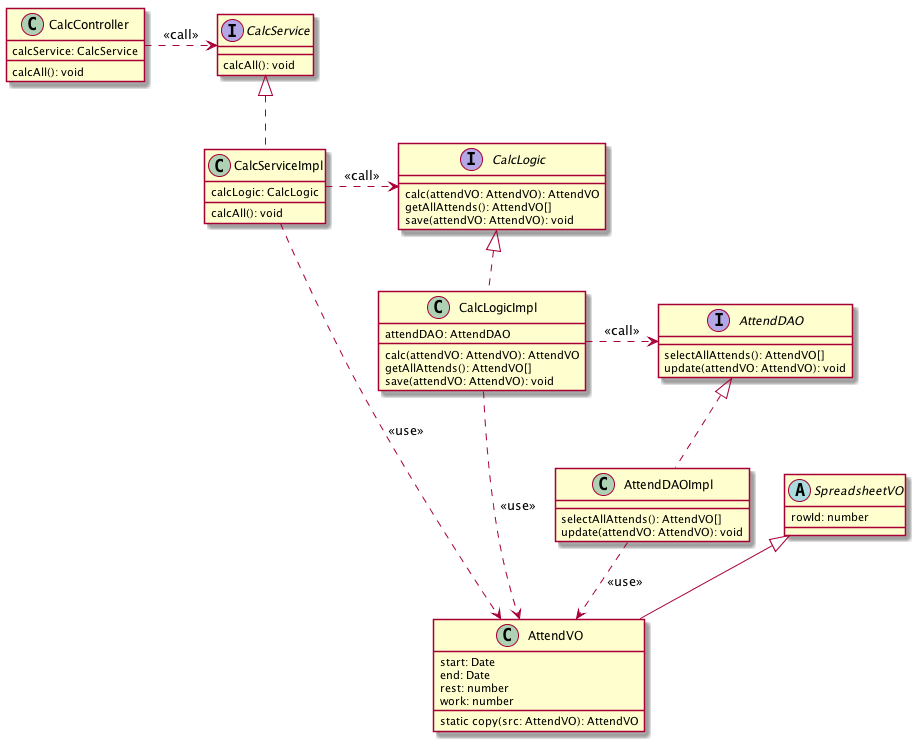
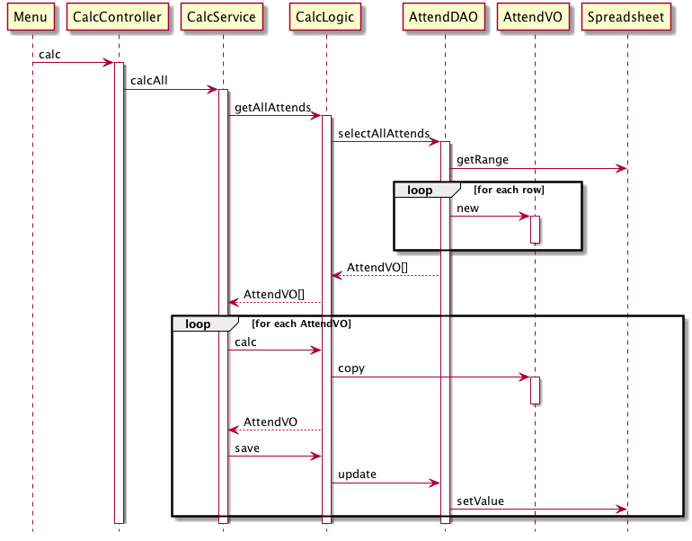

# spreadsheet_test

## 目的

SpraedsheetをGoogleAppsScriptでいじるための練習と仕組み作り。

## 構成

Spring Frameworkを意識したパッケージ構成を取っています。

### controller

画面からの指示を受け付ける場所。
サービスを呼び出す。

何かあれば画面に値を返す。
（今回のサンプルは特に返していないけど、ダイアログやHTMLなどの返却はここで行う）


### service

業務を行う場所。
「OOの業務を行う」と一言で説明できるような粒度のものを扱う。

### logic

業務を遂行する上で細々としたことを行う場所。

logicは他のlogicを呼び出さない。
logicはlogicで完結する。
logicとlogicで値のやり取りが必要な場合はseriviceを介す。

### DAO

スプレッドシートとの情報をやり取りする場所。
DAOもlogicと同様に、他のDAOを呼び出すことはしない。

### VO

Value Object。

#### SpreadsheetVO

スプレッドシートのrowを保持するVO。

## 図

### クラス図

### シーケンス図

## TODO

- DIの簡略化。InversifyJSをうまく導入できなかった
- サンプルの充実。もうちょっと複数のロジックやDAOを扱いたいところ

## Author

* tamura shingo (tamura.shingo@gmail.com)

## Copyright

Copyright (c) 2018 tamura shingo (tamura.shingo@gmail.com)

## License

Licensed under the MIT License.
